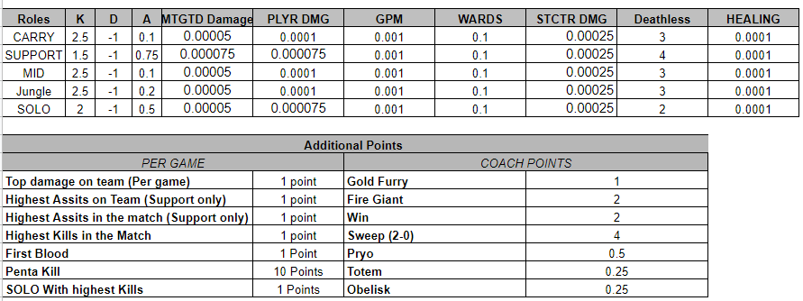

# Rules

## Draft Format

* Snake draft Format - a snake draft is when the draft reverses back and forth between who picks first and last every round. 1,2,3,4,5,5,4,3,2,1.
* 5/6 players teams per league
* Draft from all available SPL players
* Each team must have one of each of the roles (Adc/Jg/Mid/Solo/Support/Coach) 
* Each team may have no more than TWO **players** from a single roster * This rule applies only during Drafting and does not apply to coaches
* Draft order will be decided via random number generator (or by previous season rewards)
* Players in the league may name their teams
* Drafts will be done live via Discord voice chat and recorded on the league's main spreadsheet
* Auto draft is available for anyone who cannot make their Live Drafts
* At least one League Admin will be present for the live drafts

* If a participant should draft a player and that player is then replaced in the SPL at any point during the season, the affected participant will receive an extra free agent pick up from all available players (to compensate for the roster change). **This is the only time that a Drafted team can Break the rule of 1 per role mandate**. If the player is dropped or traded, you must abide by the standard 5 roles as mentioned above.

 ## League Format

* All Fantasy Players will be allowed ONE player-to-player trade during the season (within their league).
    * Trades may involve up to TWO players per team (maximum of 4)
    * All trades must be approved by a League Administrator
    * No team adjustments allowed until round 3
* All  Official Fantasy Participants will be allowed THREE free agent changes/pick-ups during the split (within their league). 
    -Free agent pick-ups must involve a player drop via League Administrator (please @ the role and not specific admins)
    -Players cannot be added or dropped during game days 
    -Newly acquired players will not earn points for your team until their set count matches the dropped player.

*  Drafted players are counted as the Role for that Team. If a player is traded or swaps positions, you will maintain that players role and receive points for the player in said Role. **Example** - Jarcorr (ADC) swapping to Solo. If you previous drafted Jarcorrr you will now earn points for Zapman who is the Leviathans ADC.

* In the case of SPL subs playing in place of a drafted player, the fantasy owner will receive points from the ROLE on their player's team so they are not punished by an unknown issue. 

* In case of an exact tie in points between potential top 2 finishers, the first and second tiebreakers will be most combined kills, then least combined deaths from each player's roster, and then (if needed) fewest roster changes.

Extra notes missing above:
* For the purpose of swaps/trade/roster changes/role swaps you draft the role on the specific team. This rule is in place to keeps things as fair as possible when roster changes happen to teams, reducing the variability of the points that player will gain during that split. This role also adresses issues with role swaps, if these occur then a fantasy team could end up with multiple players playing the same role, even though the draft is specifically designed to only pick one player per role.
    * Example Scenario 1: A trade happens which swaps Paul and Pegon between the Styx Ferrymen and the Oni Warriors. Those who originally drafted Paul will now have Pegon, and those who had Pegon will now have Paul.
    * Example Scenario 2: Nika and Dardez play on the same team in solo and mid respectively, and decide to role swap. Anyone who picked Nika in the initial draft would get points from Dardez playing the solo role.
    * Real Complex Example Scenario from 2021 Season: Julio (Solo) gets dropped by the Leviathians. Zapman (Carry) replaces Julio on the Leviathans leaving the Scarabs, after Jarcoor moves from Carry to Solo. Stuart (Carry) joins the Scarabs. Players who picked up Julio would now have Jarcoor, those with Jarcoor would now have Zapman, and those with Zapman originally would now have Stuart.

## Scoring

Triple Doubles - will earn players a BONUS 10 points
